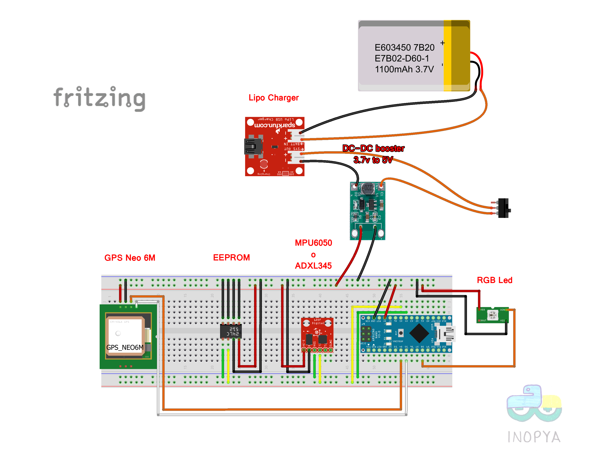

# GPS_data_logger_eeprom_multisesion
Data logger para el GPS de "@Norma, la perra", 
Graba datos en eeprom externa de hasta 64Kb y dispone de grabacion en modo multisesion
Es decir puede acumualr sesiones sucesivas de manera que no sobreescribe los datos anteriores

Version actual,  v1.2
Dispone de un acelerometro para detectar que Norma se ha quedado parada y no grabar datos.
Los modulos GPS NEO6/7/8 tienen un cierto error de deriva lo genera "una nube de puntos" aun estando en una poscion fija.

   ===== NOTAS DE LA VERSION =====
   
   GPS data logger para Norma la perra,
   Version para corregir los problemas de la version con grabacion en SD
   que corrompia las tarjetas si las sesiones eran muy largas (y la bateria se agotaba).
   
   Ante la imposibilidad de saber cuando va a volver la muy perra,
   en este montaje realizamos la grabacion de datos en eeprom externa.
   Inicialmente usaremos una eeprom del tipo 24LC256, es decir 32Kbytes, 
   pero el programa admite memorias de hasta 64Kbytes.
   Si realizamos la grabacion de posicion unicamente (latitud y longitud) a intervalos de 5 segundos
   disponemos de un tiempo de algo más de 5 horas y media. O de más de 11 horas si tomamos datos cada 10 segundos.
   (Obviamente el programa se puede adaptar para que grabe otro tipo de informacion).

   - Añadimos un acelerometro para descartar el "baile" que produce el GPS aun estando en absoluto reposo.
     De esta manera si el acelerometro no muestra indicios de movimiento, no grabamos ningun dato 
     y alargamos aun mas la duracion de la eeprom.
   
   - Añadida la opcion de grabar sesiones multiples mientras quede memoria disponible.
     Ayuda a no sobreescribir siempre la misma zona, ya que podemos ir añadiendo sesiones 
     hasta completar todo el espacio de laeeprom y de paso protege los datos ya grabados
     si se produce algun reinicio durante alguna sesion.
   
   - Añadido un menu Serial para la recuperacion de datos y otras tareas sobre la eeprom.
     Consultar la funcion "mostrar_menu_serial()" para mas detalles de todas las opciones disponibles.

   - Añadidos control de tiempo disponible para grabacion y bloqueo del programa para evitar sobreescribir
     si una sesion fuese mas larga que el tiempo disponible.

   - Anadida opcion de menu para la lectura en modo RAW de la eeprom (por si falla la FAT)
     y deseamos tener acceso a su contenido para tratar de recuperar informacion de forma manual.

   - Cambiado el sistema de FAT (respecto de la version beta),
     para hacerlo mas intuitivo y facil de manejar en caso de "catastrofe".

   - Posibilidad de acceso y consulta de sesiones individuales o listado completo del contenido grabado.

   - Incrementado el espacio FAT respecto a la version Beta, pasamos de 48 posibles sesiones a 148**.
     (El usuario puede controlar dicho tamaño a voluntad, modificando donde comienza 
      el espacio de 'datos de usuario', ya que la FAT se extiende  hasta dicha zona).
      ** Maximas sesiones admitidas 255, ya que el registro destinado a ellas es un solo byte.
         Si fuese necesario se puede modificar sin demasiada complicacion.

   <<< CODIGOS DE COLOR DEL LED RGB, SEGUN ESTADO DEL DATALOGGER  >>> 

    * AMARILLO: 1 segundo al iniciar, Avisa de puesta en marcha y advierte de posibles reinicios.

    * AZUL: al inicio color fijo, en espera de ordenes de teclado (xx segundos), 
            Pasado ese tiempo se inicia automaticamente el proceso de toma de muestras.
  
    * AZUL/PARPADEO: en espera de ordenes de teclado en bucle infinito (podemos interrumpir pulsando 'Q').
  
      Si se pulsa 'L' se listan datos de la sesion anterior:
        * NARANJA/AMARILLO: Modo Usuario, listando datos.
        * VERDE:  Modo Usuario, pausa infinita tras listar datos. La eeprom queda reservada de uso.

    
    * ROJO: Modo Activo, a espera de señal GPS valida para iniciar grabacion.
    * ROSA/MORADO: Modo Activo, guardando una muestra. Un parpadeo que se apaga tras guardarla.
    * ROSA/MORADO: Modo Activo, Si queda encendido permanente, avisa de Fin de memoria, o fin de FAT
    * APAGADO: Modo Activo, GPS ok, esperando entre muestras.

**Menu Serial**

**Informacion de sesiones**

**Representacion sobre mapa de algunas rutas de Norma**

